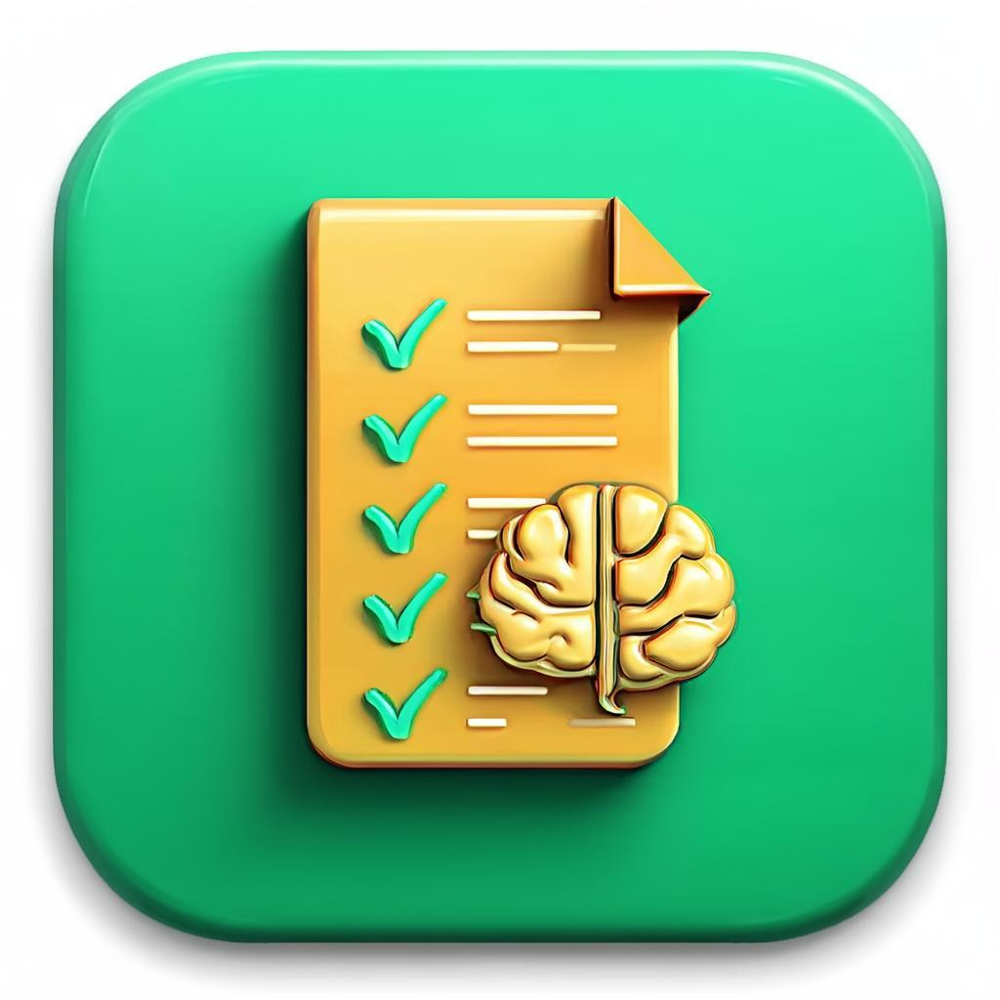

# AWE Desktop - Automated Writing Evaluation System

<div align="center">
  
  
  <h3>AI-Powered Writing Assessment for Educators</h3>
  
  <p>
    A Windows desktop application that uses local LLMs for automated writing evaluation,
    designed for educators and students at Sultan Qaboos University.
  </p>

  <p>
    <strong>Developed by: Dr. Waleed Mandour, 2026</strong>
  </p>
</div>

---

## 📋 Table of Contents

- [Features](#features)
- [Screenshots](#screenshots)
- [System Requirements](#system-requirements)
- [Installation](#installation)
- [Quick Start](#quick-start)
- [LLM Configuration](#llm-configuration)
- [OCR Support](#ocr-support)
- [Building from Source](#building-from-source)
- [Architecture](#architecture)
- [API Reference](#api-reference)
- [Contributing](#contributing)
- [License](#license)

---

## ✨ Features

### Core Features

- **🤖 Local LLM Integration**: Use AI models locally without internet connection
- **📝 Handwriting Recognition**: OCR support for scanned documents and images
- **📊 IELTS-Based Assessment**: Comprehensive evaluation based on IELTS criteria
- **📈 Detailed Feedback**: Actionable suggestions for improvement

### LLM Support

- **Ollama** (Recommended) - Run open-source models locally
- **LM Studio** - User-friendly local LLM runner
- **OpenAI API** - Cloud-based GPT models (requires API key)
- **Custom Endpoints** - Any OpenAI-compatible API

### Assessment Criteria

The system evaluates essays based on four IELTS criteria:

1. **Task Response** - How well the essay addresses the prompt
2. **Coherence & Cohesion** - Organization and logical flow
3. **Lexical Resource** - Vocabulary range and accuracy
4. **Grammar Accuracy** - Grammatical range and accuracy

---

## 🖥️ System Requirements

### Minimum Requirements

| Component | Requirement |
|-----------|-------------|
| OS | Windows 10 or later (64-bit) |
| RAM | 8 GB |
| CPU | 4 cores |
| Storage | 10 GB free space |

### Recommended Requirements

| Component | Requirement |
|-----------|-------------|
| OS | Windows 11 (64-bit) |
| RAM | 16 GB or more |
| CPU | 8 cores |
| GPU | NVIDIA GPU with 8GB+ VRAM |
| Storage | 20 GB free space |

### LLM Model Requirements

| Model Size | Minimum RAM | Recommended RAM |
|------------|-------------|-----------------|
| 3B parameters | 8 GB | 16 GB |
| 7-8B parameters | 16 GB | 32 GB |
| 14B parameters | 32 GB | 48 GB |
| 70B parameters | 64 GB | 128 GB |

---

## 📥 Installation

### Option 1: Download Installer (Recommended)

1. Download the latest installer from [Releases](https://github.com/waleedmandour/awe-desktop/releases)
2. Run `AWE-Desktop-Setup-{version}.exe`
3. Follow the installation wizard
4. Launch AWE Desktop from the Start Menu

### Option 2: Portable Version

1. Download the portable executable from [Releases](https://github.com/waleedmandour/awe-desktop/releases)
2. Run `AWE-Desktop-Portable-{version}.exe` directly
3. No installation required

### Prerequisites

Before using AWE Desktop, ensure you have:

1. **Ollama** (Recommended)
   ```bash
   # Download from https://ollama.ai
   # Then pull a model:
   ollama pull llama3:8b
   ```

2. **Python 3.10+** (for backend)
   ```bash
   # Check Python version
   python --version
   ```

---

## 🚀 Quick Start

### 1. Start Ollama

```bash
# Make sure Ollama is running
ollama serve

# In another terminal, download a model
ollama pull llama3:8b
```

### 2. Launch AWE Desktop

- Open AWE Desktop from the Start Menu
- The application will automatically detect your system and Ollama

### 3. First Assessment

1. Click **"Get Started"** on the welcome screen
2. Select or create a course
3. Upload an essay image or paste text
4. Review the extracted text
5. Click **"Start Assessment"**
6. View detailed results and feedback

---

## ⚙️ LLM Configuration

### Ollama Setup (Recommended)

```bash
# Install Ollama from https://ollama.ai

# Pull recommended models
ollama pull llama3:8b          # Best balance of speed and quality
ollama pull mistral:7b         # Fast and efficient
ollama pull phi3:mini          # Lightweight option for low-spec PCs
```

### LM Studio Setup

1. Download LM Studio from https://lmstudio.ai
2. Open LM Studio and download a model
3. Start the local server (default: http://127.0.0.1:1234)
4. In AWE Desktop, go to Settings → LLM Settings → Custom Endpoint
5. Enter `http://127.0.0.1:1234/v1`

### Custom API Setup

For cloud APIs or custom endpoints:

1. Go to Settings → LLM Settings → Custom Endpoint
2. Enter the API base URL
3. If required, enter your API key
4. Click Save Configuration

---

## 🔍 OCR Support

AWE Desktop supports multiple OCR engines for extracting text from images:

### Tesseract OCR (Default)

```bash
# Windows - Download installer from:
# https://github.com/UB-Mannheim/tesseract/wiki

# Add to PATH or set in Settings
```

### PaddleOCR (Better for Handwriting)

```bash
pip install paddleocr paddlepaddle
```

### Google Vision (Cloud-Based)

1. Get a Google Cloud API key
2. Enable Vision API
3. Configure in Settings

---

## 🔨 Building from Source

### Prerequisites

- Node.js 18+
- Python 3.10+
- Git

### Build Steps

```bash
# Clone the repository
git clone https://github.com/waleedmandour/awe-desktop.git
cd awe-desktop

# Install frontend dependencies
npm install

# Install Python dependencies
pip install -r python-backend/requirements.txt

# Development mode
npm run electron:dev

# Build for Windows
npm run electron:build:win

# Output will be in the 'release' folder
```

### Build Outputs

| Output | Description |
|--------|-------------|
| `AWE-Desktop-Setup-{version}.exe` | Windows installer |
| `AWE-Desktop-Portable-{version}.exe` | Portable executable |

---

## 🏗️ Architecture

```
AWE Desktop Architecture
========================

┌─────────────────────────────────────────────────────────────┐
│                     Electron Application                     │
├─────────────────────────────────────────────────────────────┤
│  ┌─────────────────┐    ┌─────────────────────────────────┐ │
│  │   Main Process  │    │        Renderer Process         │ │
│  │   (Node.js)     │    │        (React + TypeScript)     │ │
│  │                 │    │                                 │ │
│  │  • IPC Handler  │◄──►│  • UI Components                │ │
│  │  • File System  │    │  • State Management (Zustand)   │ │
│  │  • System Info  │    │  • Animations (Framer Motion)   │ │
│  │  • Auto-updater │    │                                 │ │
│  └────────┬────────┘    └────────────────┬────────────────┘ │
│           │                              │                   │
│           │         HTTP (localhost)     │                   │
│           └──────────────┬───────────────┘                   │
│                          ▼                                   │
│           ┌─────────────────────────────────┐               │
│           │     Python FastAPI Backend       │               │
│           │     (Port 8765)                  │               │
│           │                                  │               │
│           │  • OCR Processing                │               │
│           │  • LLM Integration               │               │
│           │  • Assessment Logic              │               │
│           └─────────────────────────────────┘               │
│                          │                                   │
│                          ▼                                   │
│  ┌───────────────────────────────────────────────────────┐  │
│  │                   External Services                     │  │
│  │                                                         │  │
│  │  ┌─────────┐  ┌──────────┐  ┌────────────────────────┐ │  │
│  │  │ Ollama  │  │ Tesseract│  │ Custom LLM Endpoints   │ │  │
│  │  │ :11434  │  │   OCR    │  │ (OpenAI-compatible)    │ │  │
│  │  └─────────┘  └──────────┘  └────────────────────────┘ │  │
│  └───────────────────────────────────────────────────────┘  │
└─────────────────────────────────────────────────────────────┘
```

### Technology Stack

| Layer | Technology |
|-------|------------|
| Frontend | React 18, TypeScript, Framer Motion |
| Desktop | Electron 28 |
| State | Zustand |
| Backend | Python, FastAPI, Uvicorn |
| OCR | Tesseract, PaddleOCR |
| LLM | Ollama, OpenAI API, Custom endpoints |
| Database | SQLite (via Zustand persist) |

---

## 📚 API Reference

### Backend Endpoints

#### System Information

```
GET /api/system-info
```

Returns system specs and LLM recommendations.

#### LLM Management

```
GET /api/llm/providers          # List available providers
GET /api/llm/ollama/status      # Check Ollama status
POST /api/llm/ollama/pull       # Download a model
POST /api/llm/provider          # Set active provider
```

#### OCR

```
POST /api/ocr
Body: { "image": "<base64>", "provider": "tesseract" }
```

#### Assessment

```
POST /api/assess
Body: { 
  "text": "essay content...", 
  "provider": "ollama",
  "model": "llama3:8b"
}
```

---

## 🤝 Contributing

Contributions are welcome! Please follow these steps:

1. Fork the repository
2. Create a feature branch (`git checkout -b feature/amazing-feature`)
3. Commit your changes (`git commit -m 'Add amazing feature'`)
4. Push to the branch (`git push origin feature/amazing-feature`)
5. Open a Pull Request

### Development Guidelines

- Use TypeScript for all frontend code
- Follow the existing code style
- Add tests for new features
- Update documentation as needed

---

## 📄 License

This project is licensed under the MIT License - see the [LICENSE](LICENSE) file for details.

---

## 🙏 Acknowledgments

- Sultan Qaboos University for supporting this project
- The Ollama team for making local LLMs accessible
- Open source community for OCR tools and libraries

---

## 📞 Support

For issues and feature requests, please use the [GitHub Issues](https://github.com/waleedmandour/awe-desktop/issues) page.

---

<div align="center">
  <p>
    <strong>AWE Desktop</strong> - Making AI-powered writing assessment accessible to all educators
  </p>
  <p>
    © 2026 Dr. Waleed Mandour, Sultan Qaboos University
  </p>
</div>
